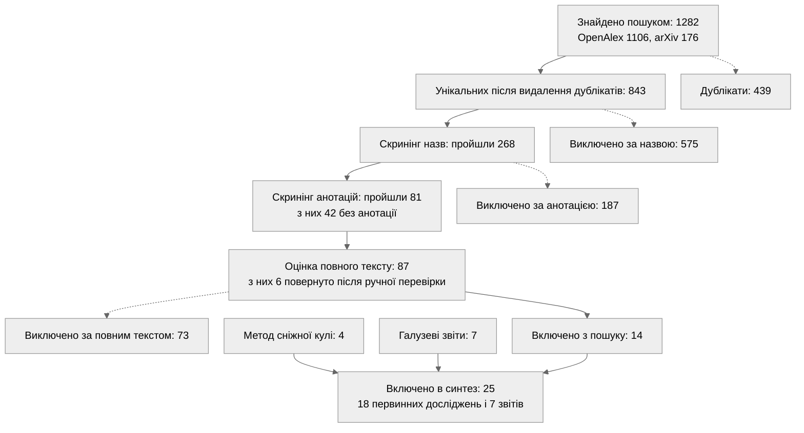
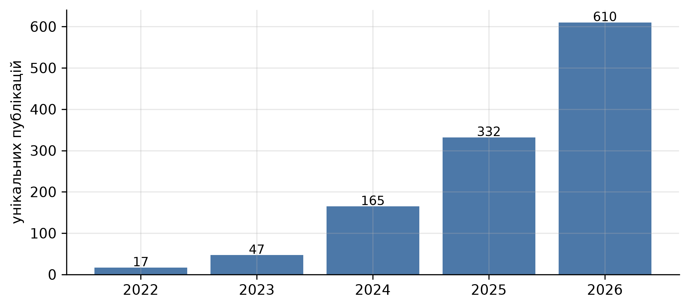
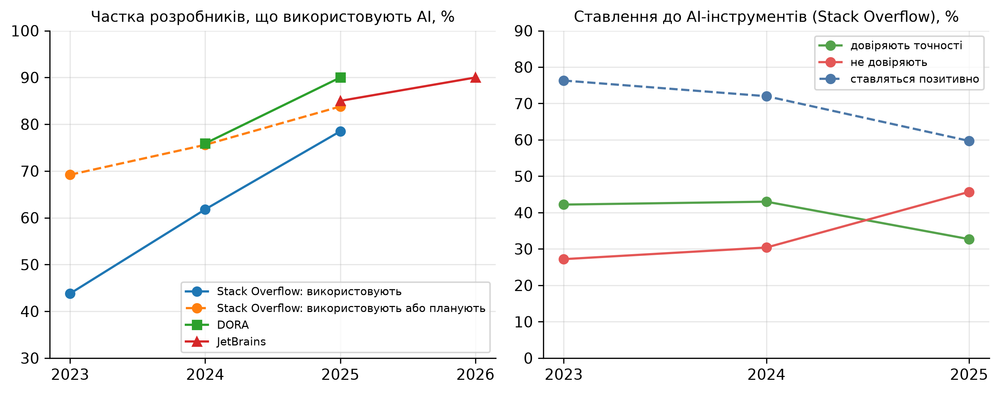
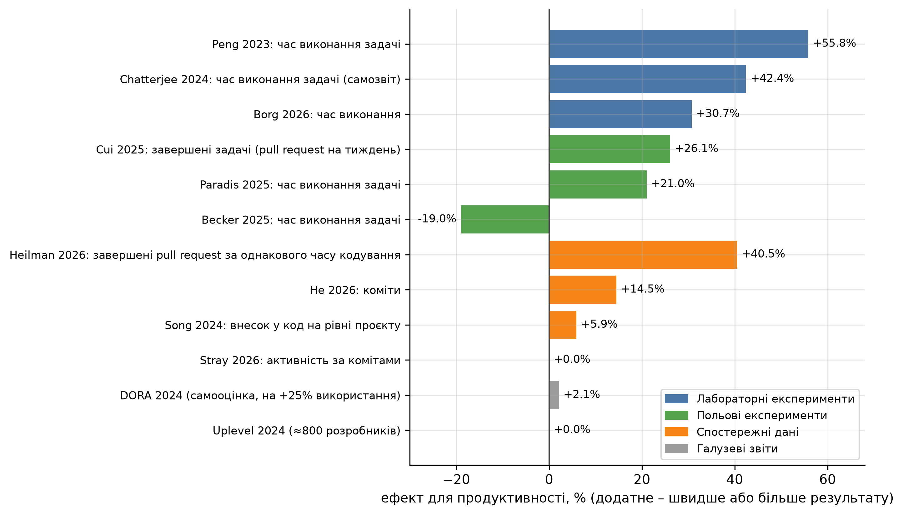
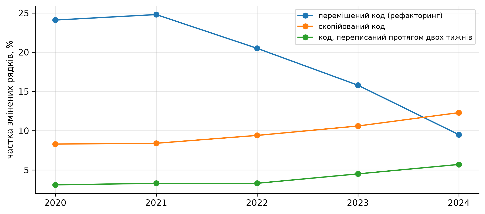
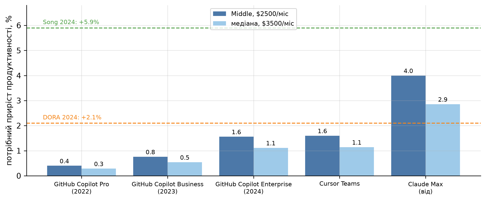

# Мета роботи

Ознайомитися з загальними показниками економічного стану індустрії програмного забезпечення і виконати дослідження (Systematic Literature Review) сучасного стану галузі.

# 1. Аспект дослідження

Аспект дослідження – економічна ефективність використання AI-асистентів у розробці програмного забезпечення: продуктивність, якість коду і вартість за даними первинних досліджень 2022–2026 років.

З 2022 року AI-асистенти швидко поширились серед розробників: у 2023 році ними користувались 44% респондентів опитування Stack Overflow, у 2025 році – 78% [1, 2]. Основна стаття витрат IT-компанії – оплата праці розробників, тому зміна їхньої продуктивності безпосередньо впливає на витрати компанії. При цьому опубліковані оцінки ефекту сильно відрізняються: в одних дослідженнях час виконання задач скорочувався більш ніж наполовину, в інших зростав. Тому для роботи обрано саме цей аспект.

Показники, які використано в роботі, наведено в таблиці 1.

Таблиця 1 – Показники дослідження

| Показник | Одиниця | Що характеризує |
| ------------------------------------- | --------------------------- | ----------------------------------- |
| Зміна часу виконання задачі | % | Продуктивність на рівні окремої задачі |
| Зміна обсягу результату (pull request, коміти, внесок у код) | % | Продуктивність на рівні розробника чи проєкту |
| Частка коду з вразливостями або дефектами | % | Якість і ризики, що несуть приховані витрати |
| Стабільність поставок, повторно переписаний код | %, частка рядків | Наслідки для процесу розробки |
| Частка розробників, що використовують AI | % | Поширеність технології |
| Вартість ліцензії AI-інструмента | $/міс | Прямі витрати |
| Зарплата розробника | $/міс | Вартість праці, на яку впливає AI |
| Точка беззбитковості | % приросту продуктивності | Умова окупності інструмента |

# 2. Протокол огляду

Огляд виконано за процедурою систематичного огляду літератури Кітченхем і Чартерс [3] з трьома фазами: планування, проведення, звітування. Результати пошуку і відбору подано за схемою PRISMA 2020 [4].

## 2.1. Дослідницькі питання

Таблиця 2 – Дослідницькі питання

| № | Питання |
| ------------------- | --------------------------------------------------------------------------------- |
| ДП1 | Як використання AI-асистентів змінює продуктивність розробників за даними експериментальних і спостережних досліджень? |
| ДП2 | Як використання AI-асистентів впливає на якість і безпеку коду та стабільність поставок? |
| ДП3 | Як змінювались поширеність AI-інструментів, ставлення до них і їхня вартість у 2022–2026 роках? |
| ДП4 | За яких умов використання AI-асистента економічно окупається? |
| ДП5 | Чим пояснюється розбіжність оцінок ефекту між дослідженнями? |

## 2.2. Джерела і пошукові рядки

Пошук виконано 04.10.2026 через відкриті API двох баз: OpenAlex [5], що індексує понад 250 млн публікацій, зокрема матеріали ACM, IEEE, Springer і Elsevier, і arXiv, де виходить більшість свіжих досліджень у галузі. Період – публікації 2022–2026 років. Пошук за назвою та анотацією, мова – англійська, оскільки література за темою англомовна. Пошукові рядки сформовано з трьох груп термінів: інструмент, контекст розробки і показник (таблиця 3).

Таблиця 3 – Пошукові рядки

| № | Пошуковий рядок | Ціль |
| ---------- | -------------------------------------------------------- | ----------------------------------- |
| S1 | ("GitHub Copilot" OR "AI coding assistant" OR "AI pair programmer" OR "AI tools" OR "AI assistance" OR "generative AI") AND ("developer productivity" OR "programmer productivity" OR "software development productivity") | Продуктивність |
| S2 | ("generative AI" OR "large language model" OR "LLM" OR "Copilot") AND ("software development" OR "software engineering") AND ("randomized controlled trial" OR "field experiment" OR "controlled experiment") | Експериментальні дизайни |
| S3 | ("GitHub Copilot" OR "AI coding assistant" OR "AI-generated code" OR "LLM-generated code") AND ("code quality" OR "defects" OR "bugs" OR "security vulnerabilities") | Якість і безпека коду |

Для arXiv рядки адаптовано до синтаксису його API з пошуком в анотаціях. Перша версія рядка S1 не охоплювала формулювання «AI tools» і «AI assistance», через що не знаходила відомих рандомізованих експериментів METR і Google. Тому рядок було розширено.

## 2.3. Критерії відбору

Таблиця 4 – Критерії включення та виключення

| Тип | Код | Критерій |
| ------------------------------ | ----------------- | ----------------------------------------------------- |
| Включення | КВ1 | Дослідження інструментів генерації коду чи AI-асистентів у розробці ПЗ |
| Включення | КВ2 | Кількісний результат щодо продуктивності, часу, якості, безпеки чи вартості |
| Включення | КВ3 | Емпіричні дані: розробники, реальні репозиторії чи сценарії реального інструмента |
| Включення | КВ4 | Публікація 2022–2026 років англійською, доступний повний текст |
| Виключення | КВи1 | Вторинні дослідження: огляди, метааналізи, синтези |
| Виключення | КВи2 | Пропозиція нового методу чи інструмента замість вимірювання ефекту |
| Виключення | КВи3 | Оцінка мовної моделі без розробників і реального проєкту |
| Виключення | КВи4 | Освітній контекст: студенти, навчальні курси |
| Виключення | КВи5 | Немає групи порівняння чи базової лінії, лише сприйняття, або недостатньо методологічних даних |

## 2.4. Оцінка якості

Кожне включене дослідження оцінено за п'ятьма критеріями. Оцінка за критерієм – 1, 0.5 або 0 балів, максимальна сума – 5 (таблиця 5).

Таблиця 5 – Критерії оцінки якості первинних досліджень

| Код | Критерій | 1 бал | 0.5 бала | 0 балів |
| --------- | ----------------------- | ------------------------- | --------------------------- | ----------------- |
| ОЯ1 | Дизайн з групою порівняння | Рандомізований експеримент | Квазіексперимент чи фіксовані ефекти | Немає порівняння |
| ОЯ2 | Реалістичність умов | Реальні проєкти чи компанія | Реалістичні лабораторні задачі | Синтетичні задачі |
| ОЯ3 | Розмір вибірки | 100 і більше розробників чи 1000 спостережень | 30–99 розробників | Менше 30 |
| ОЯ4 | Метрика і невизначеність | Метрику визначено, є довірчі інтервали чи похибки | Метрику визначено, без оцінки похибки | Метрика нечітка |
| ОЯ5 | Незалежність | Автори не пов'язані з виробником інструмента | Автори чи дані від виробника | – |

# 3. Результати пошуку

Пошук дав 1282 записи: 1106 з OpenAlex і 176 з arXiv. Після видалення 439 дублікатів лишилось 843 унікальні публікації. Хід відбору показано на рисунку 1 і в таблиці 6.

Рисунок 1 – Схема відбору досліджень PRISMA

Таблиця 6 – Результати пошуку і відбору

| Етап | Пройшли | Виключено | Причини виключення |
| ----------------------- | ------------------- | --------------------- | ------------------------------------- |
| Пошук | 1282 | – | – |
| Видалення дублікатів | 843 | 439 | Той самий DOI чи назва в кількох базах і рядках |
| Скринінг назв | 268 | 575 | Немає AI-інструмента – 146, немає показника – 309, не розробка ПЗ – 85, огляд, освіта чи бенчмарк – 35 |
| Скринінг анотацій | 81 | 187 | Не емпіричне – 118, немає кількісного результату – 41, пропозиція методу – 28 |
| Повний текст | 14 | 73 | КВи5 – 28, КВи3 – 25, КВи2 – 14, КВи1 – 4, КВи4 – 2 |

Скринінг назв і анотацій виконано автоматично за критеріями таблиці 4 із наступною ручною перевіркою. Записи без анотації в базі передано на оцінку повного тексту, щоб не виключити їх за формальною ознакою. Ручна перевірка виключених за анотацією знайшла 6 релевантних робіт, які фільтр пропустив через формулювання анотації, – зокрема дослідження безпеки коду Perry та ін. і експеримент ANZ Bank. Їх було повернуто на оцінку повного тексту.

Методом сніжної кулі, тобто за списками літератури включених робіт, додано 4 дослідження, яких пошук не знайшов: два з них опубліковано як робочі документи поза індексованими базами, ще два – у 2026 році. Сім галузевих звітів (Stack Overflow, DORA, JetBrains, GitClear, Uplevel, METR) не є рецензованими публікаціями, але дають щорічні ряди показників, яких немає в академічних дослідженнях, тому включені в синтез як сіра література з окремою позначкою.

Розподіл знайдених публікацій за роками показано на рисунку 2. У 2024 році їх було 165, у 2025 – 332, а за неповний 2026 рік – уже 610.

{width=13cm}

Рисунок 2 – Кількість унікальних публікацій за роками (2026 рік – станом на жовтень)

# 4. Первинні дослідження та їхня релевантність

Включено 18 первинних досліджень. Їхні дизайн, вибірку, інструмент і оцінку якості наведено в таблиці 7, де РКД – рандомізоване контрольоване дослідження. Середня оцінка якості – 3.8 з 5. Десять досліджень мають 4 бали і більше. Найвищі оцінки отримали польові рандомізовані експерименти в компаніях і дослідження на великих масивах даних GitHub.

Таблиця 7 – Включені первинні дослідження

| Дослідження | Дизайн | Вибірка | Інструмент | Якість |
| -------------------------- | ----------------------- | ------------------- | -------------------- | ------------ |
| Pearce та ін. (2022) [6] | Лабораторна оцінка згенерованого коду | 1689 програм | GitHub Copilot | 3.0 |
| Ziegler та ін. (2022) [7] | Опитування і телеметрія | 2047 користувачів | GitHub Copilot | 3.0 |
| Peng та ін. (2023) [8] | Лабораторний РКД | 95 розробників | GitHub Copilot | 3.5 |
| Perry та ін. (2023) [9] | Лабораторний РКД | 47 учасників | OpenAI Codex | 4.0 |
| Fu та ін. (2023) [10] | Аналіз коду реальних проєктів | 733 фрагменти | Copilot та ще два | 3.5 |
| Chatterjee та ін. (2024) [11] | РКД у банку | понад 100 інженерів | GitHub Copilot | 4.0 |
| Song та ін. (2024) [12] | Порівняння проєктів на GitHub | проєкти з відкритим кодом | GitHub Copilot | 4.5 |
| Quispe і Grijalba (2024) [13] | Природний експеримент | країни із забороною ChatGPT | ChatGPT | 4.0 |
| Paradis та ін. (2024) [14] | РКД у компанії | 96 інженерів Google | Внутрішні AI-функції Google | 3.5 |
| Hoffmann та ін. (2024) [15] | Регресійний розрив | 187 489 розробників | GitHub Copilot | 4.0 |
| Weber та ін. (2024) [16] | Експеримент, кожен учасник в обох умовах | 24 учасники | GitHub Copilot, GPT-3 | 3.0 |
| Cui та ін. (2025) [17] | Три польові РКД | 4867 розробників | GitHub Copilot | 4.5 |
| Becker та ін. (2025) [18] | РКД на реальних задачах | 16 розробників, 246 задач | Cursor, Claude 3.5/3.7 | 4.5 |
| He та ін. (2025) [19] | Порівняння з контрольними репозиторіями | 806 і 1380 контрольних репозиторіїв | Cursor | 4.5 |
| Stray та ін. (2026) [20] | Лонгітюдний кейс | 39 розробників, 26 317 комітів | GitHub Copilot | 3.5 |
| Heilman та ін. (2026) [21] | Спостережне дослідження з фіксованими ефектами | 16 223 інженери | GitHub Copilot | 4.0 |
| Borg та ін. (2026) [22] | Зареєстрований наперед експеримент | 151 учасник | GitHub Copilot, Cursor | 4.5 |
| Daniotti та ін. (2026) [23] | Спостережне дослідження комітів | понад 30 млн комітів | Генеративний AI | 3.5 |

Релевантність досліджень до питань огляду показано в таблиці 8. Більшість досліджень стосується продуктивності. Окупність жодне з них прямо не розраховує, тому для ДП4 розрахунок виконано окремо на основі зібраних даних (розділ 5.5).

Таблиця 8 – Релевантність первинних досліджень і звітів до дослідницьких питань

| Питання | Первинні дослідження | Галузеві звіти |
| -------------------------------- | ------------------------------------ | -------------------------------- |
| ДП1 Продуктивність | Peng, Chatterjee, Song, Quispe, Paradis, Hoffmann, Weber, Cui, Becker, He, Stray, Heilman, Borg, Daniotti, Ziegler | DORA 2024, Uplevel, METR 2026 |
| ДП2 Якість і безпека | Pearce, Perry, Fu, Weber, He, Borg | DORA 2024, GitClear, Uplevel |
| ДП3 Поширеність і вартість | Daniotti | Stack Overflow, DORA 2025, JetBrains, ціни інструментів |
| ДП4 Окупність | Розрахунок на основі ДП1 і ДП3 | DOU, ціни інструментів |
| ДП5 Розбіжність оцінок | Усі дослідження ДП1, Becker, Heilman | METR 2026 |

П'ять досліджень (Ziegler, Peng, Cui, Hoffmann, Heilman) мають авторів або дані від Microsoft чи GitHub – виробника GitHub Copilot. Це враховано в оцінці якості (ОЯ5).

# 5. Аналіз показників

## 5.1. Поширеність AI-інструментів

Частка розробників, що використовують AI-інструменти, зросла з 44% у 2023 році до 62% у 2024-му і 78% у 2025-му [1, 24, 2]. За даними DORA, у 2024 році 75.9% фахівців покладались на AI хоча б в одній щоденній задачі, у 2025 році – 90% [25, 26]. Опитування JetBrains показують 85% регулярних користувачів у 2025 році і 90% у січні 2026 року [27, 28].

{width=16.5cm}

Рисунок 3 – Поширеність AI-інструментів і ставлення до них розробників

При цьому довіра до результатів знижується. Частка тих, хто довіряє точності AI-інструментів, знизилась з 42% у 2023 році до 33% у 2025-му, а частка тих, хто не довіряє, зросла з 27% до 46%. Позитивне ставлення знизилось з 77% до 60% [2]. Отже, згенерований код доводиться перевіряти, і час на це потрібно враховувати у вартості використання AI-асистента.

Змінився і набір інструментів. У січні 2026 року на роботі GitHub Copilot використовували 29% розробників, Cursor і Claude Code – по 18%, хоча в середині 2025 року частка Claude Code становила лише близько 3% [28]. Daniotti та ін. оцінили, що на початок 2025 року AI пише 29% нових функцій Python у США [23].

## 5.2. Продуктивність

Ефекти, отримані у включених дослідженнях, зведено на рисунку 4. Додатне значення означає, що розробники з AI виконали задачу швидше або отримали більше результату.

{width=16.5cm}

Рисунок 4 – Ефект AI-асистентів для продуктивності за типом дослідження

Найбільше прискорення отримано в лабораторних експериментах на окремих задачах. У першому рандомізованому експерименті з GitHub Copilot розробники реалізували HTTP-сервер на 55.8% швидше (95% ДІ: 21–89%) [8]. В експерименті ANZ Bank група з Copilot виконала задачі на 42.4% швидше, ніж контрольна, хоча час фіксувався за самозвітом [11]. У попередньо зареєстрованому експерименті Borg та ін. медіанний час скоротився на 30.7% [22].

В експериментах у компаніях ефект менший. Три рандомізовані експерименти в Microsoft, Accenture і компанії зі списку Fortune 100 на 4867 розробниках показали +26.1% завершених задач на тиждень (стандартна похибка 10.3%) [17]. В експерименті Google на 96 інженерах час виконання задачі скоротився приблизно на 21% [14]. Натомість експеримент METR з 16 досвідченими розробниками, які працювали над власними зрілими проєктами з відкритим кодом, показав уповільнення на 19% [18].

За спостережними даними ефект здебільшого невеликий. У проєктах з відкритим кодом використання Copilot збільшило внесок у код на 5.9%, але й час координації – на 8% [12]. Після переходу на Cursor кількість комітів зросла на 55.4% у перший місяць і лише на 14.5% у другий, далі приріст зникав [19]. У державній IT-організації NAV статистично значущих змін в активності не знайдено [20]. Найбільший спостережний ефект – +40.5% завершених pull request у тижні найінтенсивнішого використання Copilot у Microsoft [21] – порівнює пікові тижні з нульовими, тому є верхньою межею.

За даними DORA 2024, збільшення використання AI на 25% супроводжується приростом самооцінки продуктивності лише приблизно на 2.1% [25]. Uplevel не знайшов значущих змін у тривалості циклу pull request серед приблизно 800 розробників [29].

Hoffmann та ін. також виявили, що розробники, які отримали Copilot, на 12.4% більше часу приділяють кодуванню і на 24.9% менше – керуванню проєктом [15].

## 5.3. Якість і безпека коду

Показники якості і безпеки коду з включених досліджень наведено в таблиці 9.

Таблиця 9 – Показники якості і безпеки коду

| Дослідження | Показник | Значення |
| ---------------------------------- | ---------------------------------------- | -------------------------- |
| Pearce та ін. (2022) [6] | Програми Copilot з вразливостями MITRE Top-25 | ≈40% з 1689 |
| Perry та ін. (2023) [9] | Безпечні рішення задачі шифрування | 21% з AI проти 36% без AI |
| Fu та ін. (2023) [10] | Фрагменти AI-коду в GitHub зі слабкостями безпеки | 29.5% Python, 24.2% JavaScript |
| He та ін. (2025) [19] | Попередження статичного аналізу, складність коду після Cursor | +30.3%, +41.6% |
| Uplevel (2024) [29] | Кількість дефектів у групі з Copilot | +41% |
| DORA (2024) [25] | Стабільність поставок, якість коду на +25% використання AI | −7.2%, +3.4% |
| Weber та ін. (2024) [16] | Індекс підтримуваності коду | Без змін |
| Borg та ін. (2026) [22] | Підтримуваність коду для наступних розробників | Різниці немає |

Учасники експерименту Perry та ін., які мали AI-асистента, писали менш безпечний код і водночас частіше вважали його безпечним [9]. У дослідженні He та ін. на 806 репозиторіях прискорення після переходу на Cursor зникло приблизно за два місяці, а складність коду лишилась підвищеною [19]. Два експерименти не знайшли погіршення підтримуваності [16, 22], але вони вимірюють результат одразу після виконання задачі, а не через місяці.

Дані GitClear на 211 млн змінених рядків показують, як змінилась структура змін коду в галузі (рисунок 5) [30]. Частка переміщеного коду, що зазвичай свідчить про рефакторинг, знизилась з 24.1% у 2020 році до 9.5% у 2024-му. Частка скопійованого коду зросла з 8.3% до 12.3%, а частка коду, переписаного протягом двох тижнів після появи, – з 3.1% до 5.7%. У 2024 році вперше скопійованого коду стало більше, ніж переміщеного. GitClear – комерційна компанія, і пов'язати ці зміни саме з AI вона може лише за збігом у часі, тож це свідчення кореляції, а не причинного зв'язку.

{width=14cm}

Рисунок 5 – Структура змін коду за даними GitClear, 2020–2024

## 5.4. Вартість інструментів

Ціни основних AI-асистентів наведено в таблиці 10. Номінальні ціни з 2022 року не зростали: GitHub Copilot для одного розробника коштує $10 на місяць з моменту виходу, а з 1 червня 2026 року GitHub переходить на оплату за використання при тих самих базових цінах тарифів [31]. Водночас з'явились дорожчі тарифи для агентних інструментів – від $100 на місяць.

Таблиця 10 – Ціни AI-асистентів для розробки

| Інструмент і тариф | Ціна, $/міс | Дата появи |
| ------------------------------------------------- | ----------------------------- | ---------------------- |
| GitHub Copilot для одного розробника (зараз Pro) [32] | 10 | 21.06.2022 |
| GitHub Copilot Business [33] | 19 за користувача | 2023 |
| GitHub Copilot Enterprise [34] | 39 за користувача | 27.02.2024 |
| Cursor Pro / Teams [35] | 20 / 40 за користувача | – |
| Claude Pro / Max, з Claude Code [36] | 20 / від 100 | – |

Для порівняння, медіанна зарплата розробника в Україні влітку 2026 року становила $3500 на місяць, медіанна зарплата рівня Middle – $2500 [37]. Загальна медіана за три роки майже не змінилась: $3435 у 2023 році [38] і $3500 у 2026-му. Отже, ліцензія коштує 0.3–4% зарплати розробника.

## 5.5. Окупність

Інструмент окупається, якщо вартість заощадженого часу розробника перевищує вартість ліцензії. Мінімальний приріст продуктивності, за якого це виконується:

$$\Delta P^{*} = \frac{C_{інстр}}{C_{розр}},$$

де $C_{інстр}$ – місячна вартість ліцензії, $C_{розр}$ – місячна вартість праці розробника. Для GitHub Copilot Business і розробника рівня Middle

$$\Delta P^{*} = \frac{19}{2500} = 0.76\%.$$

Точки беззбитковості для всіх тарифів наведено на рисунку 6. Для звичайних тарифів вона становить 0.3–1.6%, тобто достатньо заощаджувати від пів години до 2–3 годин на місяць. Навіть найменший позитивний ефект з галузевих звітів (DORA, +2.1%) перевищує поріг для всіх тарифів, крім агентних тарифів від $100 на місяць.

{width=16cm}

Рисунок 6 – Точка беззбитковості AI-асистента залежно від тарифу і зарплати

Місячний економічний ефект для розробника рівня Middle за різних сценаріїв розраховано як $E = \Delta P \cdot C_{розр} - C_{інстр}$ (таблиця 11).

Таблиця 11 – Економічний ефект на одного розробника рівня Middle, $/міс

| Сценарій | Ефект | Вартість часу | Ліцензія | Чистий ефект |
| ------------------------------ | --------------- | -------------------- | ----------------- | ------------------ |
| DORA 2024, самооцінка | +2.1% | 52.5 | 19 | +33.5 |
| Відкритий код, Song та ін. | +5.9% | 147.5 | 19 | +128.5 |
| Польові експерименти, Cui та ін. | +26.1% | 652.5 | 19 | +633.5 |
| Досвідчені розробники, METR | −19% | −475 | 20 | −495 |

Розрахунок спрощений. Зарплата «на руки» менша за повну вартість праці для роботодавця, тому для компанії поріг окупності ще нижчий. З іншого боку, ефекти виміряно на задачах кодування, а розробник кодує не весь робочий час, тому за місяць ефект буде меншим. Також вартість дефектів і вразливостей (розділ 5.3) у розрахунку не врахована: зростання кількості дефектів на 41% [29] чи складності коду на 41.6% [19] з'їдає частину виграшу через витрати на супровід.

Отже, щодо ДП4: якщо враховувати лише ціну ліцензії, AI-асистент окупається вже за невеликого позитивного ефекту. Значно сильніше на результат впливають величина самого ефекту, яка в дослідженнях дуже різна, і витрати на виправлення дефектів.

## 5.6. Чому оцінки розходяться

Розкид оцінок від −19% до +56% пов'язаний з такими чинниками.

1. Тип задачі і середовище. Лабораторні задачі невеликі і починаються з нуля, тоді як у реальних проєктах треба розуміти чужий код і зрілу архітектуру. Метааналіз 23 досліджень дав помірний середній ефект (g = 0.33) з більшими значеннями в контрольованих умовах і меншими – у компаніях і відкритому коді [39].
2. Досвід розробника. Найбільше виграють менш досвідчені розробники [17, 15], а досвідчені в знайомих їм проєктах можуть сповільнюватись [18].
3. Метрика. Час виконання задачі, кількість pull request і кількість комітів вимірюють різне. Кількість pull request можна збільшити, розбивши роботу на дрібніші частини, тому автори Heilman та ін. окремо перевіряли цю гіпотезу [21].
4. Тривалість спостереження. Прискорення після впровадження нестійке: у He та ін. воно зменшилось з 55.4% до 14.5% за місяць [19].
5. Самооцінка. Учасники METR очікували прискорення на 24% і після експерименту вважали, що працювали на 20% швидше, хоча фактично сповільнились на 19% [18]. Тому звіти, побудовані на опитуваннях, імовірно завищують ефект. METR у 2026 році визнав, що вже не може надійно виміряти ефект за своїм дизайном: 30–50% розробників відмовлялись виконувати частину задач без AI [40].

# Висновки

У роботі виконано систематичний огляд літератури щодо економічної ефективності AI-асистентів у розробці ПЗ. Пошук в OpenAlex і arXiv дав 1282 записи, з яких після відбору за протоколом включено 14 досліджень; ще 4 додано методом сніжної кулі і 7 галузевих звітів – як джерела щорічних показників.

1. Поширеність AI-асистентів за три роки зросла з 44% до 78–90% розробників, а кількість досліджень за темою подвоюється щороку. При цьому частка тих, хто не довіряє результатам AI, зросла з 27% до 46%.
2. Ефект для продуктивності залежить від умов: +21–56% у лабораторних і корпоративних експериментах, +2–6% у реальних проєктах і галузевих даних, −19% для досвідчених розробників у зрілих проєктах. Найбільше виграють менш досвідчені розробники, а прискорення після впровадження частково зникає з часом.
3. Дані про якість переважно свідчать про ризики: 24–40% згенерованого коду містить вразливості, стабільність поставок знижується, а частка повторно переписаного і скопійованого коду в галузі зростає.
4. Ліцензія коштує 0.3–4% зарплати розробника і окупається вже при прирості продуктивності близько 1%. Тому економічна ефективність більше залежить від реального ефекту в конкретній команді і витрат на якість коду, ніж від ціни інструмента.
5. Компанії, що впроваджує AI-асистентів, варто вимірювати ефект на власних задачах з контрольною групою, а не за самооцінкою розробників, і враховувати витрати на перевірку коду та виправлення дефектів.

# Список джерел

1. Stack Overflow Developer Survey 2023. Stack Overflow. URL: https://survey.stackoverflow.co/2023/ (дата звернення: 04.10.2026).
2. Stack Overflow Developer Survey 2025: AI. Stack Overflow. URL: https://survey.stackoverflow.co/2025/ai (дата звернення: 04.10.2026).
3. Kitchenham B., Charters S. Guidelines for performing Systematic Literature Reviews in Software Engineering : EBSE Technical Report EBSE-2007-01. Keele University and Durham University, 2007. 65 p.
4. Page M. J., McKenzie J. E., Bossuyt P. M. et al. The PRISMA 2020 statement: an updated guideline for reporting systematic reviews. BMJ. 2021. Vol. 372. n71. DOI: 10.1136/bmj.n71. URL: https://www.prisma-statement.org/ (дата звернення: 04.10.2026).
5. Priem J., Piwowar H., Orr R. OpenAlex: A fully-open index of scholarly works, authors, venues, institutions, and concepts. arXiv:2205.01833. 2022. URL: https://openalex.org/ (дата звернення: 04.10.2026).
6. Pearce H., Ahmad B., Tan B., Dolan-Gavitt B., Karri R. Asleep at the Keyboard? Assessing the Security of GitHub Copilot's Code Contributions. 2022 IEEE Symposium on Security and Privacy (SP). 2022. URL: https://arxiv.org/abs/2108.09293 (дата звернення: 04.10.2026).
7. Ziegler A., Kalliamvakou E., Simister S. et al. Productivity Assessment of Neural Code Completion. MAPS 2022: Proceedings of the 6th ACM SIGPLAN International Symposium on Machine Programming. 2022. URL: https://arxiv.org/abs/2205.06537 (дата звернення: 04.10.2026).
8. Peng S., Kalliamvakou E., Cihon P., Demirer M. The Impact of AI on Developer Productivity: Evidence from GitHub Copilot. arXiv:2302.06590. 2023. URL: https://arxiv.org/abs/2302.06590 (дата звернення: 04.10.2026).
9. Perry N., Srivastava M., Kumar D., Boneh D. Do Users Write More Insecure Code with AI Assistants? CCS '23: Proceedings of the 2023 ACM SIGSAC Conference on Computer and Communications Security. 2023. P. 2785–2799. URL: https://arxiv.org/abs/2211.03622 (дата звернення: 04.10.2026).
10. Fu Y., Liang P., Tahir A., Li Z. Security Weaknesses of Copilot-Generated Code in GitHub Projects: An Empirical Study. arXiv:2310.02059. 2023. URL: https://arxiv.org/abs/2310.02059 (дата звернення: 04.10.2026).
11. Chatterjee S., Liu C. L., Rowland G., Hogarth T. The Impact of AI Tool on Engineering at ANZ Bank: An Empirical Study on GitHub Copilot within Corporate Environment. arXiv:2402.05636. 2024. URL: https://arxiv.org/abs/2402.05636 (дата звернення: 04.10.2026).
12. Song F., Agarwal A., Wen W. The Impact of Generative AI on Collaborative Open-Source Software Development: Evidence from GitHub Copilot. arXiv:2410.02091. 2024. URL: https://arxiv.org/abs/2410.02091 (дата звернення: 04.10.2026).
13. Quispe A. Q., Grijalba R. Impact of the Availability of ChatGPT on Software Development: A Synthetic Difference in Differences Estimation using GitHub Data. arXiv:2406.11046. 2024. URL: https://arxiv.org/abs/2406.11046 (дата звернення: 04.10.2026).
14. Paradis E., Grey K., Madison Q. et al. How much does AI impact development speed? An enterprise-based randomized controlled trial. arXiv:2410.12944. 2024. URL: https://arxiv.org/abs/2410.12944 (дата звернення: 04.10.2026).
15. Hoffmann M., Boysel S., Nagle F., Peng S., Xu K. Generative AI and the Nature of Work : Harvard Business School Working Paper 25-021. 2024. URL: https://www.hbs.edu/ris/download.aspx?name=25-021.pdf (дата звернення: 04.10.2026).
16. Weber T., Brandmaier M., Schmidt A., Mayer S. Significant Productivity Gains through Programming with Large Language Models. Proceedings of the ACM on Human-Computer Interaction. 2024. Vol. 8, EICS. Art. 256. DOI: 10.1145/3661145 (дата звернення: 04.10.2026).
17. Cui K. Z., Demirer M., Jaffe S., Musolff L., Peng S., Salz T. The Effects of Generative AI on High-Skilled Work: Evidence from Three Field Experiments with Software Developers. Management Science. 2026. DOI: 10.1287/mnsc.2025.00535. URL: https://economics.mit.edu/sites/default/files/inline-files/draft_copilot_experiments.pdf (дата звернення: 04.10.2026).
18. Becker J., Rush N., Barnes E., Rein D. Measuring the Impact of Early-2025 AI on Experienced Open-Source Developer Productivity. arXiv:2507.09089. 2025. URL: https://arxiv.org/abs/2507.09089 (дата звернення: 04.10.2026).
19. He H., Miller C., Agarwal S., Kästner C., Vasilescu B. Speed at the Cost of Quality: How Cursor AI Increases Short-Term Velocity and Long-Term Complexity in Open-Source Projects. arXiv:2511.04427. 2025. URL: https://arxiv.org/abs/2511.04427 (дата звернення: 04.10.2026).
20. Stray V., Brandtzæg E. G., Wivestad V. T., Barbala A. Developer Productivity With and Without GitHub Copilot: A Longitudinal Mixed-Methods Case Study. Proceedings of the 59th Hawaii International Conference on System Sciences. 2026. DOI: 10.24251/hicss.2026.880 (дата звернення: 04.10.2026).
21. Heilman A., Kyllo A., Murphy-Hill E. R. GitHub Copilot and Developer Productivity: An Observational Dose-Response Analysis. arXiv:2606.00438. 2026. DOI: 10.48550/arxiv.2606.00438 (дата звернення: 04.10.2026).
22. Borg M., Hewett D., Hagatulah N., Couderc N. Echoes of AI: Investigating the downstream effects of AI assistants on software maintainability. Empirical Software Engineering. 2026. DOI: 10.1007/s10664-026-10889-1 (дата звернення: 04.10.2026).
23. Daniotti S., Wachs J., Feng X., Neffke F. Who is using AI to code? Global diffusion and impact of generative AI. Science. 2026. DOI: 10.1126/science.adz9311. URL: https://arxiv.org/abs/2506.08945 (дата звернення: 04.10.2026).
24. Stack Overflow Developer Survey 2024: AI. Stack Overflow. URL: https://survey.stackoverflow.co/2024/ai (дата звернення: 04.10.2026).
25. Accelerate State of DevOps Report 2024. DORA, Google Cloud. URL: https://services.google.com/fh/files/misc/2024_final_dora_report.pdf (дата звернення: 04.10.2026).
26. Announcing the 2025 DORA Report: State of AI-assisted Software Development. Google Cloud Blog. 2025. URL: https://cloud.google.com/blog/products/ai-machine-learning/announcing-the-2025-dora-report (дата звернення: 04.10.2026).
27. The State of Developer Ecosystem 2025. JetBrains Research Blog. 2025. URL: https://blog.jetbrains.com/research/2025/10/state-of-developer-ecosystem-2025/ (дата звернення: 04.10.2026).
28. Which AI Coding Tools Do Developers Actually Use at Work? JetBrains Research Blog. 2026. URL: https://blog.jetbrains.com/research/2026/04/which-ai-coding-tools-do-developers-actually-use-at-work/ (дата звернення: 04.10.2026).
29. AI Won't Solve Your Developer Productivity Problems for You. Uplevel. 18.10.2024. URL: https://uplevelteam.com/blog/ai-for-developer-productivity (дата звернення: 04.10.2026).
30. AI Copilot Code Quality: 2025 Look Back at 12 Months of Data. GitClear. 2025. URL: https://www.gitclear.com/ai_assistant_code_quality_2025_research (дата звернення: 04.10.2026).
31. GitHub Copilot is moving to usage-based billing. The GitHub Blog. 2026. URL: https://github.blog/news-insights/company-news/github-copilot-is-moving-to-usage-based-billing/ (дата звернення: 04.10.2026).
32. GitHub Copilot is generally available to all developers. The GitHub Blog. 21.06.2022. URL: https://github.blog/news-insights/product-news/github-copilot-is-generally-available-to-all-developers/ (дата звернення: 04.10.2026).
33. GitHub Copilot is generally available for businesses. The GitHub Blog. 2023. URL: https://github.blog/news-insights/product-news/github-copilot-is-generally-available-for-businesses/ (дата звернення: 04.10.2026).
34. GitHub Copilot Enterprise is now generally available. The GitHub Blog. 27.02.2024. URL: https://github.blog/news-insights/product-news/github-copilot-enterprise-is-now-generally-available/ (дата звернення: 04.10.2026).
35. Pricing. Cursor. URL: https://cursor.com/pricing (дата звернення: 04.10.2026).
36. Pricing. Claude. URL: https://claude.com/pricing (дата звернення: 04.10.2026).
37. Зарплати розробників – літо 2026. DOU. 13.07.2026. URL: https://dou.ua/lenta/articles/salary-report-devs-summer-2026/ (дата звернення: 04.10.2026).
38. Зарплати розробників – літо 2023. DOU. 2023. URL: https://dou.ua/lenta/articles/salary-report-devs-summer-2023/ (дата звернення: 04.10.2026).
39. Maier S., Gunzenhäuser M., Schweisthal J., Schneider M. A meta-analysis of the effect of generative AI on productivity and learning in programming. arXiv:2605.04779. 2026. URL: https://arxiv.org/abs/2605.04779 (дата звернення: 04.10.2026).
40. We are Changing our Developer Productivity Experiment Design. METR. 24.02.2026. URL: https://metr.org/blog/2026-02-24-uplift-update/ (дата звернення: 04.10.2026).
